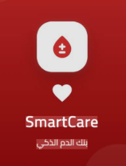
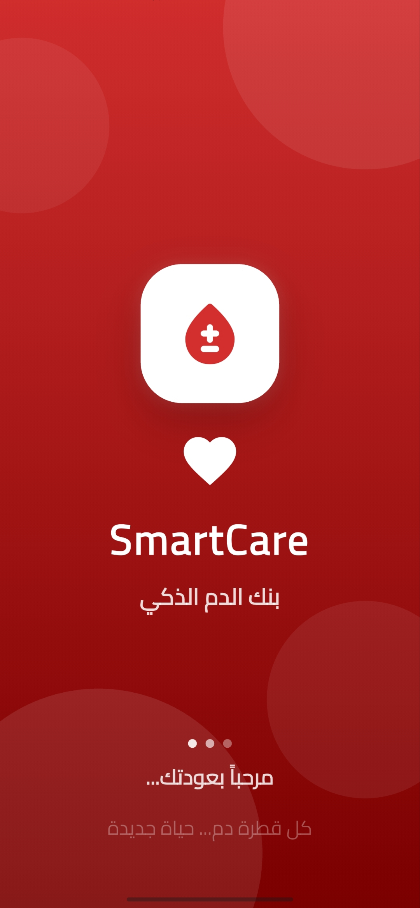
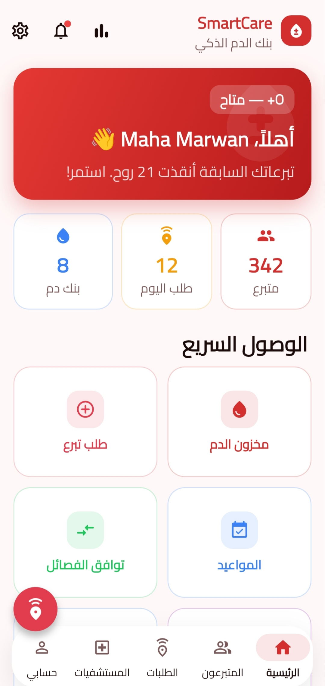
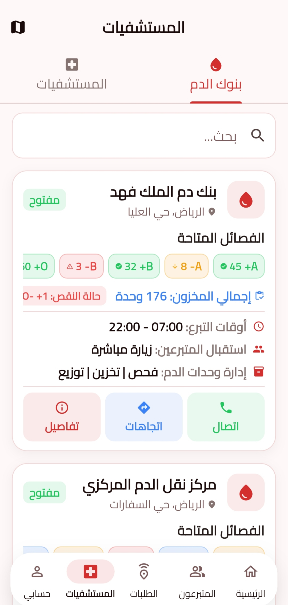
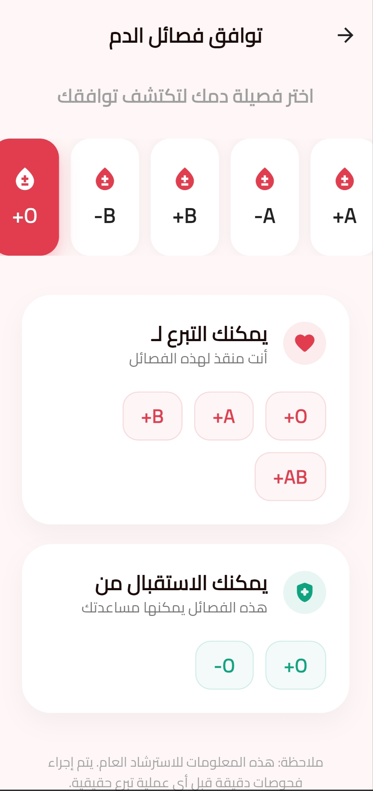

<div align="center">
  
  <h1 align="center">SmartCare</h1>
  <h3 align="center">سمارت كير - بنك الدم الذكي</h3>
  <p align="center">
    A comprehensive blood donation management and emergency blood request platform
  </p>
  <p align="center">
    <a href="#features">Features</a> •
    <a href="#screenshots">Screenshots</a> •
    <a href="#tech-stack">Tech Stack</a> •
    <a href="#getting-started">Getting Started</a> •
    <a href="#project-structure">Structure</a> •
    <a href="#license">License</a>
  </p>
</div>

---

## About

**SmartCare** is a cross-platform Flutter application designed to bridge the gap between blood donors and those in need. Whether you're looking to donate blood, request an urgent transfusion, locate the nearest blood bank, or track your donation journey — SmartCare provides a seamless, real-time experience.

The app supports **Arabic** and **English**, features a **dark mode**, and is built with **Firebase** at its core for real-time data sync, authentication, and push notifications.

---

## Features

### Authentication & Onboarding
- 3-page animated onboarding walkthrough
- Email/password registration & login
- Google Sign-In integration
- Phone number OTP verification
- Password reset flow

### Dashboard
- Personalized welcome banner with user stats
- Quick stats cards (donations, requests, notifications)
- Quick action grid (Blood Stock, Request Donation, Appointments, Compatibility Check, Statistics)
- Urgent blood requests feed
- Emergency Broadcast FAB button

### Blood Stock Management
- Real-time stock levels for all 8 blood types
- Color-coded progress indicators (Critical, Low, Moderate, Good)
- Visual legend and summary

### Donor Management
- Browse donor list with blood-type filter chips
- Real-time donor data from Firestore + API
- Join as donor registration form
- Digital donor card with QR code

### Blood Requests
- View requests by status (Active, Urgent, All)
- Create new blood requests via bottom sheet
- One-tap "Donate Now" action
- Real-time updates from Firestore

### Request Tracking
- Interactive 5-stage donation timeline
- Searching for donor animation
- Donor found confirmation screen
- Donation completion summary with post-donation tips
- Link to blood bank inventory

### Hospitals & Blood Banks
- Searchable hospital directory
- Detailed hospital view with services & requests
- Blood bank listings with stock levels
- Bank details with location & contact info

### Map Integration
- OpenStreetMap with flutter_map
- Markers for blood banks, hospitals, and donors
- Filter chips for category selection
- Bottom info panel with details
- Location-based FAB

### Appointments
- Book donation appointments (bank, date, time)
- Tabbed view (Upcoming, Completed, Cancelled)
- Appointment management

### Emergency Broadcast
- Dramatic full-screen SOS interface
- Pulsing red alert animation
- Sends emergency broadcast to nearby donors

### Notifications
- Real-time push notifications via Firebase Cloud Messaging
- Blood-type topic subscriptions
- Notification history from Firestore
- Badge indicator on bottom nav

### Statistics & Analytics
- Summary cards (registered donors, lives saved, monthly requests)
- Blood-type distribution bar chart
- Monthly donations bar chart
- Request status breakdown

### Blood Compatibility Checker
- Select your blood type
- Shows compatible donors and recipients
- Visual compatibility lists

### Profile & Settings
- User profile with donation tracking
- Edit profile (name, phone, photo)
- Change password
- Privacy & security settings
- Appearance (Light / Dark / System)
- Language (Arabic / English)
- About app, Privacy Policy, Terms & Conditions

---

## Screenshots

| Onboarding | Dashboard | Blood Stock | Donors |
|:---:|:---:|:---:|:---:|
|  |  |  |  |

| Map | Tracking | Emergency | Profile |
|:---:|:---:|:---:|:---:|
|  |  |  |  |

> **Note:** Add actual screenshots to a `screenshots/` directory. These are placeholder references.

---

## Tech Stack

### Framework
- **Flutter** — Cross-platform UI framework
- **Dart** ^3.11.5

### State Management
- **GetX** — Primary (controllers, routing, DI, reactive state)
- **Provider** — Legacy (BloodProvider)

### Backend & Services
- **Firebase Core** — App initialization
- **Firebase Auth** — Email/password, Google Sign-In, Phone OTP
- **Cloud Firestore** — Real-time NoSQL database
- **Firebase Cloud Messaging** — Push notifications
- **Firebase Storage** — Media storage
- **GetStorage** — Local key-value persistence
- **SharedPreferences** — Local caching

### UI & Animations
- Material 3 Design
- Google Fonts (Cairo — Arabic-optimized)
- flutter_animate — Extensive screen animations
- fl_chart — Bar charts & statistics
- timeline_tile — Donation journey timeline
- qr_flutter — QR code generation
- shimmer — Loading placeholders
- badges — Notification badges

### Maps & Location
- flutter_map (OpenStreetMap)
- latlong2 — Geolocation coordinates

### Networking
- http — REST API calls (DummyJSON donor data)
- url_launcher — Phone calls & navigation

---

## Getting Started

### Prerequisites
- Flutter SDK ^3.11.5
- Dart ^3.11.5
- Firebase project (configured via `flutterfire configure`)

### Installation

```bash
# Clone the repository
git clone https://github.com/yourusername/smartbloodcare.git
cd smartbloodcare

# Install dependencies
flutter pub get

# Run the app
flutter run
```

### Firebase Setup

1. Create a Firebase project at [firebase.google.com](https://firebase.google.com)
2. Enable Authentication (Email/Password, Google, Phone)
3. Create a Firestore database
4. Enable Firebase Cloud Messaging
5. Generate platform-specific config files:
```bash
flutterfire configure --project=your-firebase-project-id
```

---

## Project Structure

```
lib/
├── main.dart                      # App entry point
├── firebase_options.dart          # Firebase configuration
├── core/
│   ├── constants/                 # AppColors, constants
│   ├── controllers/               # AuthController, DonorController
│   ├── localization/              # AppTranslations, LocaleController
│   ├── routes/                    # AppRoutes, AppPages
│   ├── services/                  # FirestoreService, NotificationService
│   └── theme/                     # AppTheme, ThemeController
├── data/
│   ├── models/                    # Data models (User, Donor, Request, etc.)
│   └── api_data.dart              # API service
└── presentation/
    ├── auth/                      # Login, Register, ForgotPassword, OTP
    ├── blood_banks/               # BloodBanksScreen, BankDetail
    ├── blood_request/             # RequestList, EmergencyBroadcast
    ├── blood_stock/               # StockScreen
    ├── donor/                     # DonorList, DonorForm, DonorProfile
    ├── home/                      # HomeScreen (Dashboard + Bottom Nav)
    ├── hospitals/                 # HospitalsScreen, HospitalDetail
    ├── map/                       # MapScreen
    ├── notifications/             # NotificationsScreen
    ├── onboarding/                # OnboardingScreen
    ├── profile/                   # ProfileScreen, Compatibility
    ├── settings/                  # Settings, EditProfile, About, etc.
    ├── splash/                    # SplashScreen
    ├── statistics/                # StatisticsScreen
    ├── tracking/                  # TrackingScreen + sub-screens
    ├── appointments/              # Appointments, BookAppointment
    └── widgets/                   # Reusable widgets
```

---

## Architecture

SmartCare follows a **feature-first** architecture with **GetX** for state management and dependency injection:

- **Controllers** manage business logic and reactive state
- **Services** handle Firebase operations, notifications, and API calls
- **Models** provide type-safe data serialization (`fromMap`/`toMap`)
- **Screens** are pure UI widgets consuming controller state
- **Routes** are centralized with lazy-loaded `GetPage` bindings

Data flows from **Firestore streams** → **Controllers** (Rx state) → **UI** (Obx widgets), ensuring real-time updates throughout the app.

---

## Contributing

Contributions are welcome! Please feel free to submit a Pull Request.

1. Fork the project
2. Create your feature branch (`git checkout -b feature/AmazingFeature`)
3. Commit your changes (`git commit -m 'Add some AmazingFeature'`)
4. Push to the branch (`git push origin feature/AmazingFeature`)
5. Open a Pull Request

---

## License

Distributed under the MIT License. See `LICENSE` for more information.

---

<div align="center">
  Made with ❤️ for saving lives
</div>
